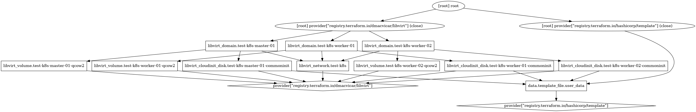

# Virtual machines for local Kubernetes test cluster

Terraform Provided Test Cluster. Provider is a Linux-based KVM / libvirt platform. One master and two worker nodes.

## Links

### Installing KVM

- https://computingforgeeks.com/how-to-install-kvm-on-fedora/

### Installing terraform

- https://learn.hashicorp.com/tutorials/terraform/install-cli

## Provisioning

        git clone https://github.com/pasiol/tf-k8s-test-cluster.git
        cd tf-k8s-test-cluster
        wget -c https://dl.rockylinux.org/pub/rocky/8.5/images/Rocky-8-GenericCloud-8.5-20211114.2.x86_64.qcow2
        qemu-img resize Rocky-8-GenericCloud-8.5-20211114.2.x86_64.qcow2 +20G
        cp Rocky-8-GenericCloud-8.5-20211114.2.x86_64.qcow2 Rocky-8-GenericCloud-8.5-20211114.2.x86_64.orig.qcow2 
        virt-resize -expand /dev/sda1 Rocky-8-GenericCloud-8.5-20211114.2.x86_64.orig.qcow2 Rocky-8-GenericCloud-8.5-20211114.2.x86_64.qcow2
        qemu-img info Rocky-8-GenericCloud-8.5-20211114.2.x86_64.qcow2
        virt-filesystems --long -h --all -a Rocky-8-GenericCloud-8.5-20211114.2.x86_64.qcow2
        rm Rocky-8-GenericCloud-8.5-20211114.2.x86_64.orig.qcow2
        terraform init
        terraform plan
        terraform graph -type=plan | dot -Tpng > graph.png
        terraform apply

